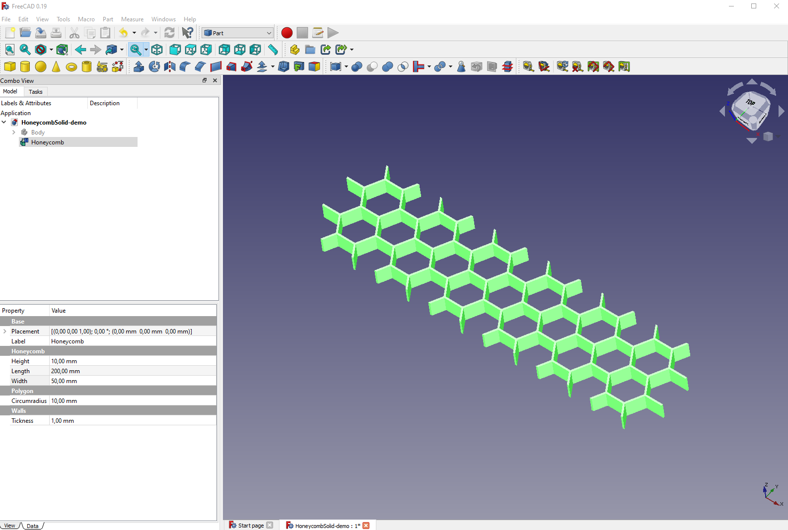

# freecad-macro-honeycomb (HoneycombSolid.FCMacro)

This is a [FreeCAD](https://www.freecadweb.org/) [Macro](https://wiki.freecadweb.org/Macros) to create a parametric Honeycomb solid

## Official repository

**NOTE:** This macro is under review after I made a [Pull Request 87](https://github.com/FreeCAD/FreeCAD-macros/pull/89) and shared into the [FreeCAD Python Scripting and Macros subforum](https://forum.freecadweb.org/viewtopic.php?f=22&t=54423).  After PR are approved, you could install this macro using the [FreeCAD Macro Addons installer](https://wiki.freecadweb.org/Std_AddonMgr)

[https://github.com/FreeCAD/FreeCAD-macros](https://github.com/FreeCAD/FreeCAD-macros)
[https://github.com/FreeCAD/FreeCAD-macros/tree/master/ParametricObjectCreation](https://github.com/FreeCAD/FreeCAD-macros/tree/master/ParametricObjectCreation)

## Macro Files

[Python file for HoneycombSolid.FCMacro](HoneycombSolid.FCMacro)
[Python file for honeycomb_solid/honeycomb_solid.py](honeycomb_solid/honeycomb_solid.py)

## Manually Install

copy the file and folder:

1. [HoneycombSolid.FCMacro](HoneycombSolid.FCMacro) 
2. [honeycomb_solid](honeycomb_solid) 

into your [FreeCAD macro place](https://wiki.freecadweb.org/How_to_install_macros)

`Edit → Preferences → General → Macro → Macro recording settings`

* **Linux:** usually /home/username/.FreeCAD/
* **Windows:** usually C:\Users\username\AppData\Roaming\FreeCAD\
* **MacOS:** usually /Users/username/Library/Preferences/FreeCAD/

**Windows Example:**

## Sample Images

## License

This module is released under the GNU Library General Public License version 2:

* [https://opensource.org/licenses/LGPL-2.0](https://opensource.org/licenses/LGPL-2.0)

## Author Information

* [Christian González Di Antonio](https://github.com/christiangda)