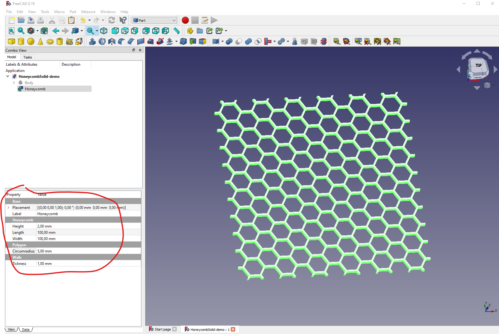

# freecad-macro-honeycomb (HoneycombSolid.FCMacro)

This is a [FreeCAD](https://www.freecadweb.org/) [Macro](https://wiki.freecadweb.org/Macros) to create a parametric Honeycomb solid

## Macro File

[Python file for HoneycombSolid.FCMacro](HoneycombSolid.FCMacro)

## Sample Images

## License

This module is released under the GNU General Public License Version 3:

* [http://www.gnu.org/licenses/gpl-3.0-standalone.html](http://www.gnu.org/licenses/gpl-3.0-standalone.html)

## Author Information

* [Christian González Di Antonio](https://github.com/christiangda)